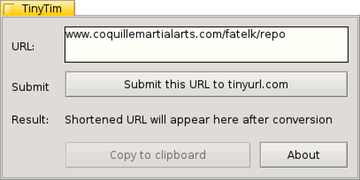

# TinyTim

by Michel Clasquin-Johnson

Public Domain software for Haiku, written in yab using the Yabadabbadoo IDE

TinyTim allows you to send a long URL to www.TinyURL.com and copy the resulting short URL to the clipboard.

Get it here: https://github.com/clasqm/TinyTim

Binaries: https://sourceforge.net/p/tinytim-for-haiku/
